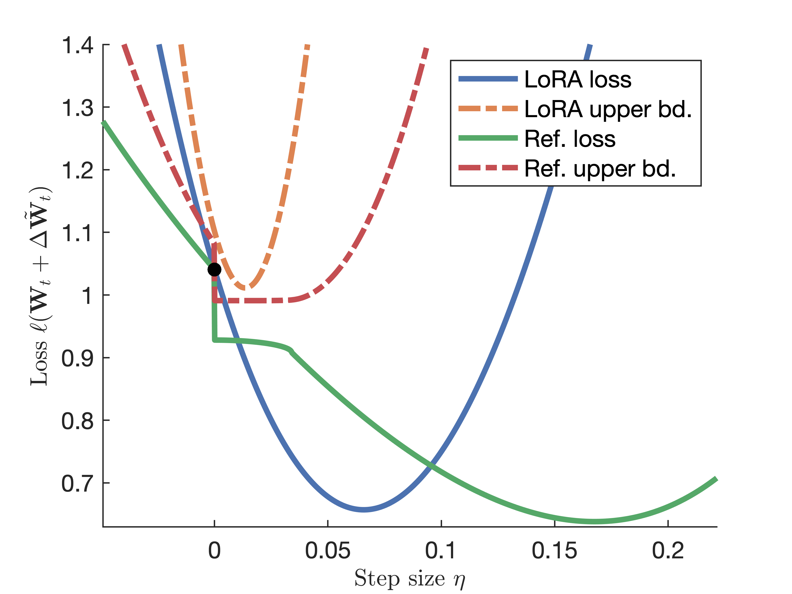

# [NeurIPS 2025] RefLoRA
[](https://arxiv.org/abs/2505.18877) [](./LICENSE)

This repository provides codes for reproducing the results in our NeurIPS 2025 paper [RefLoRA: Refactored Low-Rank Adaptation for Efficient Fine-Tuning of Large Models](https://arxiv.org/pdf/2505.18877) (to appear soon; preprint available on [arxiv](https://arxiv.org/pdf/2505.18877)). 

### Overview

This paper deals with the non-unique factorization challenge in low-rank adaptation (LoRA), which leads to inconsistent updates, unbalanced weights, and slow convergence. Specifically, for equivalent low-rank factorizations $\mathbf{A} \mathbf{B}^\top = \tilde{\mathbf{A}}\tilde{\mathbf{B}}^\top$, the resultant weight increment can differ remarkably; see analysis in our paper. 

**Key idea:** RefLoRA identifies the *optimal factorization* that minimizes the loss upper bound. We prove that this solution admits a closed-form expression, resulting in flatter loss landscape that facilitates stable and efficient optimization; see the illustrative figure below:



With the optimal refactoring, RefLoRA guarantees consistent and balanced weight updates, as well as faster empirical convergence. A simplified variant termed RefLoRA-S is developed to further reduce the overhead.

<p float="left">
    
    
    
</p>


# Experiments

### Setup

Our codes are tested with python 3.12, and packages speficied in `requirements.txt`, where our RefLoRA package is installed in the editable mode. 

```bash
pip install -r requirements.txt
```

Next, download the commonsense reasoning datasets from [LLM-Adapters](https://github.com/AGI-Edgerunners/LLM-Adapters), and prepare them as
```bash
commonsense_reasoning/
├── dataset/
│   ├── ARC-Challenge/
│   ├── ARC-Easy/
│   ├── boolq/
│   ├── hellaswag/
│   ├── openbookqa/
│   ├── piqa/
│   ├── social_i_qa/
│   └── winogrande/
└── ft-training_set/
    └── commonsense_170k.json

```

### General usage
RefLoRA integrates seamlessly with Hugging Face’s `Trainer` class via just three lines of modification, replacing `Trainer` with `RefTrainer`:
```python
from reflora import Refactorer, RefTrainer

refactorer = Refactorer(model, use_scalar=False, warmup_steps=100)
trainer = RefTrainer(*args, **kwargs, refactorer=refactorer)
```

Set `use_scalar=True` to use RefLoRA-S. 

### Natural language understanding


The following commands are used to reproduce the results for the GLUE benchmark. Hyperparameters are offered in Table 6 of Appendix D.6. 

```bash
cd glue
bash debertaV3-base.sh
```

### Commonsense reasoning


To reproduce results on commonsense reasoning datasets:

```bash
cd commonsense_reasoning
bash scripts/llama_7B.sh
bash scripts/llama2_7B.sh
bash scripts/llama3_8B.sh
```

# Credits
Our implementation builds upon the following repositories:

- https://github.com/AGI-Edgerunners/LLM-Adapters
- https://github.com/NVlabs/DoRA

# Citation
If you find this work useful, please consider citing:
> Y. Zhang, B. Li, and G. B. Giannakis, “RefLoRA: Refactored Low-Rank Adaptation for Efficient Fine-Tuning of Large Models,” in *Proceedings of Advances in Neural Information Processing Systems*, 2025. 

```tex
@inproceedings{RefLoRA, 
  author={Zhang, Yilang and Li, Bingcong and Giannakis, Georgios B.}, 
  title={RefLoRA: Refactored Low-Rank Adaptation for Efficient Fine-Tuning of Large Models}, 
  booktitle={Advances in Neural Information Processing Systems}, 
  year={2025}, 
  url={https://openreview.net/forum?id=zefDc9oi5T},
}
```
